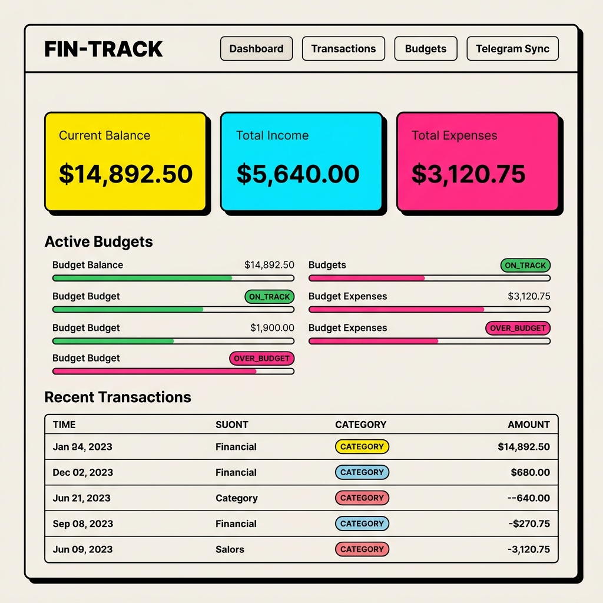
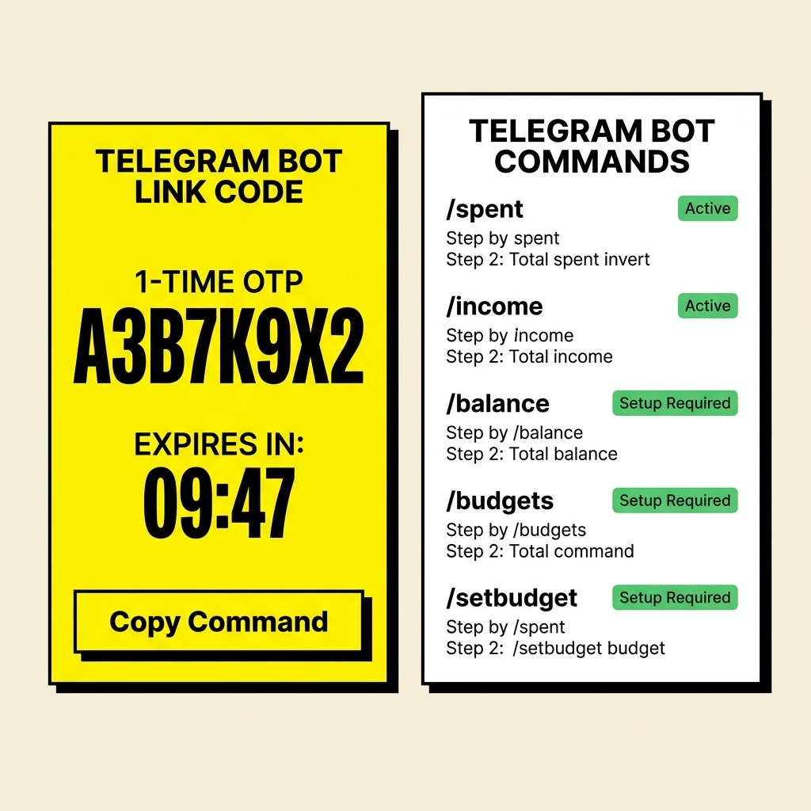

# ⚡ FIN-TRACK: Neo-Brutalist Finance Tracker & Telegram Bot Sync

[](https://oracle.com/java/)
[](https://spring.io/projects/spring-boot)
[](https://reactjs.org/)
[](https://vitejs.dev/)
[](https://core.telegram.org/bots/api)
[](LICENSE)

> A full-stack, high-performance financial management platform featuring a bold **Neo-Brutalist Web Dashboard** and **Real-Time Telegram Bot Synchronization**. Record transactions, track budgets, and receive instant spending alerts straight from Telegram or your desktop browser.

---

## 📸 Screenshots & UI Previews

### 1. Financial Overview Dashboard
The main dashboard provides real-time balance metrics, active category budget progress bars with status tags (`ON_TRACK`, `WARNING`, `OVER_BUDGET`), and recent transaction records.



### 2. Telegram Bot Control Center
Generate a secure, 1-time 8-character OTP code to link your Telegram account in under 10 seconds. Includes a live countdown timer and interactive command cheatsheet.



---

## 🔥 Key Features

- **⚡ Real-Time Telegram Sync**: Log expenses or income via simple text messages (e.g. `/spent 450 Food Domino's` or `/income 50000 Salary`). The bot immediately processes the transaction and sends instant notifications.
- **🎨 Neo-Brutalist Web UI**: Designed with high contrast, 3px solid black borders, non-interpolated hard drop shadows (`5px 5px 0px 0px #000`), Electric Yellow (`#FFE600`), Mint Cyan (`#00E5FF`), and Bright Pink (`#FF2A85`) accents.
- **📊 Budget & Threshold Monitoring**: Set weekly, monthly, or yearly spending limits per category. Visual progress bars indicate percent used, remaining allowance, and status alerts.
- **📂 Dynamic Category Engine**: Auto-seeds default expense and income categories with icons and color tokens (`Food`, `Transport`, `Shopping`, `Bills`, `Salary`, etc.).
- **🔐 Secure JWT Authentication**: Stateless security architecture using JSON Web Tokens, BCrypt password hashing, and user-scoped data protection.
- **⚙️ RESTful API**: Built with clean architecture, MapStruct DTO mapping, and standardized `ApiResponse<T>` wrappers.

---

## 🛠️ Tech Stack & Architecture

### Backend
- **Framework**: Spring Boot 3.5.0 (Java 21)
- **Security**: Spring Security 6 with JWT Stateless Authentication
- **Database / ORM**: PostgreSQL / H2 Database with Spring Data JPA
- **Integrations**: TelegramBots Spring Boot Starter
- **Utilities**: Lombok, MapStruct, Bean Validation (Jakarta Validation)

### Frontend
- **Framework**: React 18 with Vite 5
- **Styling**: Vanilla CSS Neo-Brutalist Design System + Tailwind CSS
- **Icons**: Lucide React Icons
- **HTTP Client**: Native Fetch API with auto-unwrapping and token handling

---

## 📁 Project Structure

```
finance-tracker-api/
├── docs/
│   └── images/                       # Screenshots and visual previews for documentation
│       ├── dashboard_preview.png
│       └── telegram_sync_preview.png
├── frontend/                         # Vite + React Neo-Brutalist Web App
│   ├── public/
│   ├── src/
│   │   ├── components/
│   │   │   ├── Navbar.jsx            # Top navigation bar & tab manager
│   │   │   ├── AuthView.jsx          # Login & Registration component
│   │   │   ├── DashboardView.jsx     # Financial summary cards & budget progress
│   │   │   ├── TransactionsView.jsx  # Expense/Income manager & category modals
│   │   │   ├── BudgetsView.jsx       # Budget tracker & category limit modals
│   │   │   └── TelegramView.jsx      # Telegram OTP generator & command cheatsheet
│   │   ├── api.js                    # API client with token & response unwrapping
│   │   ├── App.jsx                   # Main application shell
│   │   └── index.css                 # Neo-Brutalist CSS design system tokens
│   ├── package.json
│   └── vite.config.js
├── src/                              # Spring Boot REST API & Telegram Engine
│   └── main/java/com/financetracker/finance_tracker_api/
│       ├── config/                   # SecurityConfig, CorsConfig, CategoryDataInitializer
│       ├── controller/               # AuthController, ExpenseController, BudgetController, TelegramController, CategoryController
│       ├── dto/                      # Request & Response Data Transfer Objects
│       ├── entity/                   # JPA Entities (User, Expense, Income, Budget, Category, TelegramLinkCode)
│       ├── exception/                # GlobalExceptionHandler & custom exceptions
│       ├── mapper/                   # MapStruct mappers
│       ├── repository/               # JPA Repositories with EntityGraph annotations
│       ├── security/                 # JwtService, JwtAuthenticationFilter, CustomUserDetailsService
│       ├── service/                  # Service interfaces & implementations
│       └── telegram/                 # TelegramScheduler polling engine & TelegramCommandParser
├── pom.xml
└── README.md
```

---

## 📜 Rules, Regulations & System Policies

To ensure platform reliability, data security, and consistency, the system enforces the following core governance rules:

### 1. Security & Authentication Policies
- **Token Handling**: All API requests to `/api/v1/**` (except `/api/v1/auth/**` and `/api/v1/categories/**`) require a valid HTTP header: `Authorization: Bearer <JWT_TOKEN>`.
- **Preflight Access**: All HTTP `OPTIONS` preflight requests are permitted unauthenticated to prevent CORS blocking on web clients.
- **Password Hashing**: User passwords must be hashed using BCrypt before persistence; raw passwords are never logged or stored.

### 2. Data Isolation & Privacy Rules
- **User Scoping**: Every database query for transactions, balances, or budgets is strictly scoped to the authenticated user ID (`findByUser`). Users can never access or modify another user's financial records.
- **Telegram Linking Privacy**: Telegram account linking requires explicit 1-time OTP verification (`/link <code>`). A Telegram account can only be linked to one user account at a time.

### 3. Telegram Link OTP Expiration Policy
- **Validity Window**: OTP link codes generated via `/api/v1/telegram/link-code` expire automatically after **10 minutes**.
- **Single Use**: Once a link code is used by the Telegram bot, it is immediately invalidated and deleted from the database.

### 4. API Standardization Rules
- **Response Wrapper**: All REST endpoints return data formatted inside the standard `ApiResponse<T>` envelope:
  ```json
  {
    "success": true,
    "message": "Operation description",
    "data": { ... },
    "timestamp": "2026-07-24T17:00:00"
  }
  ```
- **Error Handling**: API errors return a clean JSON payload with HTTP error status (e.g. `400 Bad Request`, `401 Unauthorized`, `404 Not Found`).

---

## 🤖 Telegram Bot Command Reference

Send any of the following commands to your configured Telegram Bot:

| Command | Arguments | Description | Example |
| :--- | :--- | :--- | :--- |
| `/start` | `[code]` | Start the bot or link account via deep link | `/start A3B7K9X2` |
| `/link` | `<code>` | Link your Telegram account using 1-time OTP code | `/link A3B7K9X2` |
| `/spent` | `<amount> <category> [description]` | Record a new expense transaction | `/spent 450 Food Domino's` |
| `/income` | `<amount> <category> [description]` | Record a new income deposit | `/income 50000 Salary` |
| `/balance` | None | Check current balance, total income, and total expense | `/balance` |
| `/summary` | None | Fetch monthly financial summary breakdown | `/summary` |
| `/categories` | None | List available expense & income categories | `/categories` |
| `/budgets` | None | View active category budgets and spending limits | `/budgets` |
| `/setbudget` | `<amount> <category> [period]` | Create or update a category budget limit | `/setbudget 5000 Food monthly` |

---

## 🚀 Getting Started & User Guide

### Prerequisites
- **Java**: Development Kit (JDK) 21 or higher
- **Node.js**: v20.0.0 or higher & `npm`
- **Database**: PostgreSQL (or in-memory H2 for development)
- **Telegram**: A Telegram Bot token created via [@BotFather](https://t.me/BotFather)

---

### Step 1: Backend Setup & Configuration

1. Clone the repository:
   ```bash
   git clone https://github.com/sudo-om/finance-tracker-api.git
   cd finance-tracker-api
   ```

2. Configure environment variables in `src/main/resources/application.yml` (or create a `.env` file):
   ```yaml
   spring:
     datasource:
       url: jdbc:postgresql://localhost:5432/financetracker
       username: postgres
       password: yourpassword
   
   jwt:
     secret: 404E635266556A586E3272357538782F413F4428472B4B6250645367566B5970
     expiration: 86400000

   telegram:
     bot:
       token: YOUR_TELEGRAM_BOT_TOKEN
       username: YOUR_TELEGRAM_BOT_USERNAME
   ```

3. Build and run the Spring Boot server:
   ```bash
   ./mvnw clean spring-boot:run
   ```
   The backend API will start at **`http://localhost:8081`**.

---

### Step 2: Frontend Setup & Configuration

1. Open a new terminal window and navigate to the `frontend` directory:
   ```bash
   cd frontend
   ```

2. Install dependencies:
   ```bash
   npm install
   ```

3. Start the Vite development server:
   ```bash
   npm run dev -- --host
   ```
   The web application will launch at **`http://localhost:5173`** (or `5174`/`5175`).

---

### Step 3: Linking Telegram Account & Usage

1. Open the Web Application at `http://localhost:5173`.
2. Click **Register** to create a new user account (or **Sign In** if you already have an account).
3. Navigate to the **Telegram Sync** tab in the top navigation bar.
4. Click **Generate 1-Time Link Code**.
5. Copy the generated command (e.g. `/link A3B7K9X2`).
6. Open your Telegram Bot and send the command.
7. You will receive an instant confirmation message:
   ```
   ✅ Account successfully linked! You can now send spending updates directly in this chat.
   ```

---

## 📡 API Endpoint Summary

### Authentication (`/api/v1/auth`)
- `POST /api/v1/auth/register` — Register a new user account & return JWT token.
- `POST /api/v1/auth/login` — Authenticate existing user & return JWT token.

### Dashboard (`/api/v1/dashboard`)
- `GET /api/v1/dashboard/balance` — Fetch total income, total expense, balance, and savings rate.
- `GET /api/v1/dashboard/summary` — Fetch monthly financial summary breakdown.

### Categories (`/api/v1/categories`)
- `GET /api/v1/categories` — List all expense and income categories with icons and color tokens.

### Expenses (`/api/v1/expenses`)
- `GET /api/v1/expenses` — Paginated list of user expenses.
- `POST /api/v1/expenses` — Create a new expense transaction.
- `DELETE /api/v1/expenses/{id}` — Delete an expense transaction.

### Incomes (`/api/v1/incomes`)
- `GET /api/v1/incomes` — Paginated list of user income entries.
- `POST /api/v1/incomes` — Create a new income deposit.
- `DELETE /api/v1/incomes/{id}` — Delete an income deposit.

### Budgets (`/api/v1/budgets`)
- `GET /api/v1/budgets` — List all active category budgets with spending calculations.
- `POST /api/v1/budgets` — Create a new category spending limit.
- `DELETE /api/v1/budgets/{id}` — Delete a category budget.

### Telegram (`/api/v1/telegram`)
- `POST /api/v1/telegram/link-code` — Generate 1-time 8-character OTP code for Telegram linking.
- `POST /api/v1/telegram/link-chat` — Internal endpoint to bind chatId with link code.

---

## 📄 License

This project is licensed under the MIT License — see the [LICENSE](LICENSE) file for details.

---

<p align="center">
  Made with ⚡ by <strong>Om Patil</strong>
</p>
